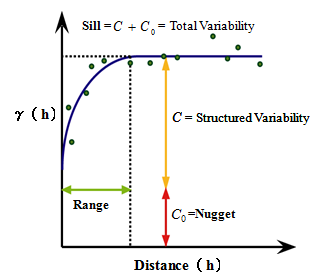

```{r setup, include=FALSE}
knitr::opts_chunk$set(echo = TRUE)
```

```{r, echo=FALSE}
setwd("C:/Users/joych/Desktop/SS/Textbook/ch8. IG")
```

### 8.2 Exploratory Data Analysis 

```{r, message = FALSE}
## package installation
library(lattice)
library(sp)
```


* relationship between zink concentration & distance to the river
```{r}
data(meuse)
head(meuse)
# assign coordinates
coordinates(meuse) <- c("x","y")
```

* Zinc concentration을 공간 위에 그린 그림:
* `spplot()`: spatial data plotting 
```{r}
par(mfrow = c(1,2))
# plotting it in 2 ways
spplot(meuse, "zinc", do.log = T, colorkey = TRUE)
bubble(meuse, "zinc", do.log = T, key.space = "bottom")
```

* Zinc 농도와 거리 간의 관계를 알고 싶다.
* 반비례 관계가 발견된다. 
```{r}
# relation between zinc concentration and distance to the river
xyplot(log(zinc) ~ sqrt(dist), as.data.frame(meuse))
```

* Use `lm()` function for regression.
```{r}
zn.lm <- lm(log(zinc) ~ sqrt(dist), meuse)
meuse$fitted.s <- predict(zn.lm, meuse) - mean(predict(zn.lm, meuse))
meuse$residuals <- residuals(zn.lm)
spplot(meuse, c("fitted.s", "residuals"))
```

* Residuals -> seems spatially correlated, it is not a white noise. 
* Residuals with a similar value occur regularly close to another. 

### 8.3 Non-geostatistical Interpolation Methods
* interpolation is done on a regular grid. 
```{r}
data(meuse.grid) # provides coordinate points on a regular grid
head(meuse.grid)
coordinates(meuse.grid) <- c("x","y") # assign a coordinate
meuse.grid <- as(meuse.grid, "SpatialPixelsDataFrame") # convert data.frame into a SpatialPixelsDataFrame
```

### 8.3.1 Inverse Distance Weighted Interpolation

#### IDW(Inverse Distance Weighted Interpolation)
* computes a weighted average
* interpolation on $s_0$, considering distances by computing weight

$$\hat{Z(s_0) = \frac{\sum_{i=1}^{n}w(s_i)Z(S_i)}{\sum_{i=1}^{n}w(s_i)}}$$,

* weights are computed according to thier distance to the interpolation location,

$$w(s_i)$ =||s_i - s_0||^{-p}$$

* p: inverse distance weighting power로, distant point 에 비해 nearer point를 얼마나 더 prefer할 거냐의 정도를 결정하는데, (보통 2)
* p 값이 클수록 가까운 점에 더 weight 많이 준다. 
  - for larger values, IDW converges to the one nearest neighbor interpolation

```{r}
library(gstat)
idw.out <- gstat::idw(zinc ~ 1, meuse, meuse.grid, idp = 2.5) # idp = 2.5
as.data.frame(idw.out)[1:5,]
# var1.pred, var1.var(=NA, becuase inverse distance does not provide prediction error variances)
```


#### Compared to Kriging 
* IDW only considers distances to the prediction. It ignores spatial configuration
 - This may lead to undesired effects if the observation locations are strongly clustered
* weight $w(s_i)$ value are guaranteed to be on (0,1), so that interpolated values never outside the range of observed values

### 8.3.2 Linear Regression
* Linear Regression for spatial prediction using `lm()`. 
```{r}
zn.lm <- lm(log(zinc) ~ sqrt(dist), meuse) 
meuse.grid$pred <- predict(zn.lm, meuse.grid)
```

* as no variogram is specified, `krige()` yields a same result. 
```{r}
## krige function
meuse.lm <- krige(log(zinc) ~ sqrt(dist), meuse, meuse.grid)
```

#### trend surface analysis: predictor - polynomials of spatial coordinates
- 좌표를 통한 polynomial로 grid point 추정
- a method based on low-order polynomials of spatial coordinates for estimating a regular grid of points from scattered obs.

```{r, eval=FALSE}
## polynomial regression
meuse.tr2 <- krige(log(zinc) ~ 1, meuse, meuse.grid, 
                   degree = 2)
## equivalently, using lm ftn
lm(log(zinc) ~ I(x^2) + I(y^2) + I(x*y)+x+y, meuse)
#or
lm(log(zinc) ~ poly(x,y, degree = 2), meuse)
```


### 8.4 Estimating Spatial Correlation: The Variogram
* **Variogram**(semivariogram) for modelling spatial correlation. 
  - variogram plots semivariance as a function of distance

* To estimate spatial correlation between two locations, given only a single pair observation, we need stationarity assumption
* *intrinsic stationarity*
  - constant mean. $Z(s) = m + e(s)$, 
  - $\gamma(h) = \frac{1}{2}E(Z(s) - Z(s+h))^2$
  - does not depend on location $s$, we can form *multiple* pairs. 
* furthermore, *isotropy*: direction independence of semivariance
 - 거리 h인 여러 pair를 방향에 관계없이 모아서 variogram 계산 가능. 
* **sample variogram**
$$\hat{\gamma}(\tilde{h_j}) = \frac{1}{2N_h} \sum_{i=1}^{N_h} (Z(s_i) - Z(s_i + h))^2, \forall \in \tilde{h_j}$$
* mean varying model: mean varies spatially 

### 8.4.1 Exploratory Variogram Analysis

* Explore spatial correlation is present or not

**1.** Plotting scatter plot use `hscat()`
- make scatter plots of pairs $Z(s_i) , Z(s_j)$, grouped by the distance $h_{ij} = ||s_i - s_j||$

```{r}
# Produce h-scatterplot
hscat(log(zinc) ~ 1, meuse, (0:9) *100) # grouped according to their distances
#up to distance 900, divided by 9 intervals. 
```
* 거리가 짧을수록 표본상관계수 값이 높은 경향 


**2.** Plotting the variogram and the variogram cloud
* variogram cloud plots all possible squared differneces of obs. pairs $(Z(s_i)-Z(s_j))^2$ against their separation distance $h_{ij}$
* when $Z(s)$ follows Gaussian, $(Z(s_i)-Z(s_j))^2$ follows a $\chi^2(1)$ distn. 

* compute variogram using `variogram()` ftn: .
```{r}
cld <- variogram(log(zinc) ~ 1, meuse, cloud = TRUE) # ~1: spatially constant mean coefficient
svgm <- variogram(log(zinc) ~ 1, meuse)
head(cld) # computes gamma for each distance
head(svgm) # np: # of points
```


```{r}
d <- data.frame(gamma = c(cld$gamma, svgm$gamma),
    dist = c(cld$dist, svgm$dist),
    id = c(rep("cloud", nrow(cld)), rep("sample variogram", nrow(svgm)))
    )
xyplot(gamma ~ dist | id, d,
    scales = list(y = list(relation = "free", 
	  #ylim = list(NULL, c(-.005,0.7)))),
	  limits = list(NULL, c(-.005,0.7)))),
    layout = c(1, 2), as.table = TRUE,
    panel = function(x,y, ...) {
        if (panel.number() == 2)
            ltext(x+10, y, svgm$np, adj = c(0,0.5)) #$
        panel.xyplot(x,y,...)
    },
    xlim = c(0, 1590),
    cex = .5, pch = 3
)

```

- 거리에 따른 sample variogram. 여기서는 1500/100 = 15(width)개의 점
- plot of averages of semivariogram cloud values over distance intervals $h$. 


#### Verify whether these increase in semivariance with distance is out of chance
* 거리에 따른 semivariance의 증가가 spatial correlation이 아닌 단순 우연에 의했을 가능성 체크
* 같은 데이터를 가지고 randomly re-assigning 하여 variogram 그리기 
```{r}
v <- variogram(log(zinc) ~ 1, meuse)
#INTERACTIVE mode out-commented:
plot(v, type = 'b', pch = 3)
fn = function(n = 100) {
       for (i in 1:n) {
          meuse$random = sample(meuse$zinc)
          v = variogram(log(random) ~ 1, meuse)
          trellis.focus("panel", 1, 1, highlight = FALSE)
          llines(v$dist, v$gamma, col = 'grey')
          trellis.unfocus()
       }
}
fn()
trellis.focus("panel", 1, 1, highlight = FALSE)
lpoints(v$dist, v$gamma, col = 'black', type = 'b', lwd = 2, pch=3)
```

- grey : variograms for randomly re-allocated data
- our sample variogram does not include in this region, so that we reject the possibility of complete spatial randomness


#### Directional sample variogram with `alpha()` (include angle information)
```{r}
plot(variogram(log(zinc)~1, meuse, alpha = (0:3)*45))
plot(variogram(log(zinc) ~ 1, meuse, alpha = seq(0,170,10))) # noise increase, as number of data decr.
```

#### Adjust cutoff, width


* cutoff: maximum distance
* width: width of distance interval (bin size) (usually cutoff/15)


```{r}
plot(variogram(log(zinc) ~ 1, meuse, cutoff=1000, width=50)) #1000/50=20, 20points appear
```

* we can also specify irregular interval 
* can zoom on the short distance variogram
```{r}
# or we can set non-regular intervals
plot(variogram(log(zinc) ~ 1, meuse, boundaries = c(0,50,100, seq(250,1500,250))))
```

### 8.4.3 Variogram Modelling

* variogram 은 spatial prediction, simulation에 쓰일 수 있다. 
* Have to ensure that predictions are associated with non-negative definite prediction variances
* Modeling 시 단순히 sample variogram value를 plugging-in 하면 matrix 의 non-negative 를 보장 못함.
* For this, infer a **parametric variogram model** from the data.
 - Also, there is a non-parametric way, using smoothing and cutting off negative frequencies in the spectral domain. 
* Fit parametric model to the sample variogram
* Some variogram parametric Models are:
```{r}
show.vgms()
show.vgms(model = "Mat", kappa.range = c(0.1,0.2,0.5,1,2,5,10), max=10) #Matern class models
```

* Valid variogram models are usually constructed by combination of two or more basic variogram models
* Nugget variance reflects usually measurement error or micro-variability. 

* `vgm(psill, model, range, psill value of nugget model)`
  - psill: partial sill(vertical extent of the model componenet)
  - range: horizontal extent
* How to construct model: 
```{r}
# example
head(vgm()) # list of models
# Exp, Sph, Gau, Mat, Pow commonly used, with or without nugget
vgm(1, "Sph",300)
vgm(1, "Sph",300,0.5)
v1 <- vgm(1, "Sph",300,0.5)
v2 <- vgm(0.8, "Sph", 800, add.to = v1) # add.to v1
v2
vgm(0.5, "Nug",0)
```

* `gstat` uses range ~parameters~, for example the exponential model with parital sill $c$ and range parameter $a$:
$$\gamma(h) = c(1-e^{-h/a}).$$
* can model practial range
* Applying to our data: `fit.variogram` function
```{r}
v <- variogram(log(zinc) ~ 1, meuse)
plot(v) # spherical model might be a reasonable choice 
fit.variogram(v, vgm(1, "Sph", 800,1)) # proper initial value
fit.variogram(v, vgm(1, "Sph", 10,1)) # far from reasonable values. #singular model 
```

* Fitting method uses non-linear regression to fit the coefficients. 
* weighted SSE $\sum_{j=1}^{p} w_j (\gamma(h) -\hat{\gamma}(h))^2$
* two optimization steps: (i) fit partial sill(c), (ii) fit range parameter(a)
* There are several weighted mehtod, default is: $N_j / h_j ^2$


#### Visual fitting 
```{r}
# library(geoR)
# v.eye <- eyefit(variog(as.geodata(meuse["zinc"]), max.dist = 1500))
# ve.fit <- as.vgm.variomodel(v.eye[[1]])
```
#### Partial fitting
```{r}
fit.variogram(v, vgm(1, "Sph", 800, 0.06), fit.sills = c(FALSE, TRUE)) # fitting only "Sph" model
```

#### Maximum likelihood fitting
```{r}
fit.variogram.reml(log(zinc) ~ 1, meuse, model = vgm(0.6, "Sph", 800, 0.06))
```
* optimal under the assumption of Gaussian random field. 

#### Directional Variogram fitting
```{r}
v.dir <- variogram(log(zinc) ~ 1, meuse, alpha = (0:3)*45)
v.anis <- vgm(.6, "Sph", 1600, .05, anis=c(45,.3))
plot(v.dir, v.anis)
```


